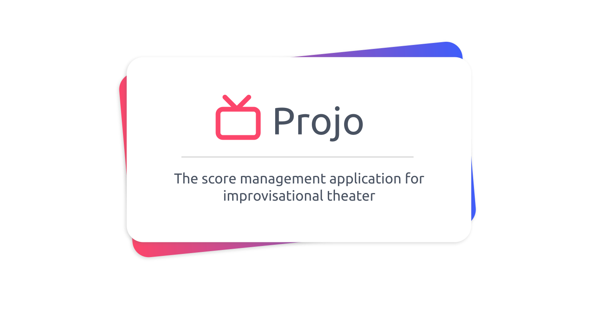

# Projo

The score management application for improvisational theater.

## Contribute

**Pull requests are welcome !** Feel free to contribute.

To contribute to this project, first clone this repo

```bash
git clone git@github.com:cauctus/projo.git
```

Then install the dependencies

```bash
npm i
```

Then start the dev server

```bash
npm run dev
```

## Deploy

This project is continuously deployed using netlify.
The preview url for the dev branch : https://dev--projo-cauctus.netlify.app/

## Credits

Coded with ❤️ by [Corentin Thomasset](https://github.com/CorentinTh).

## License

This project is under the [MIT license](LICENSE).
